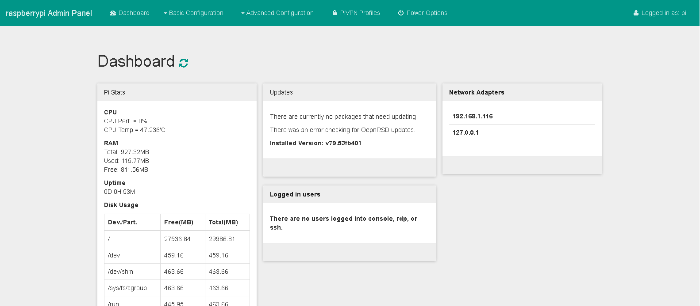
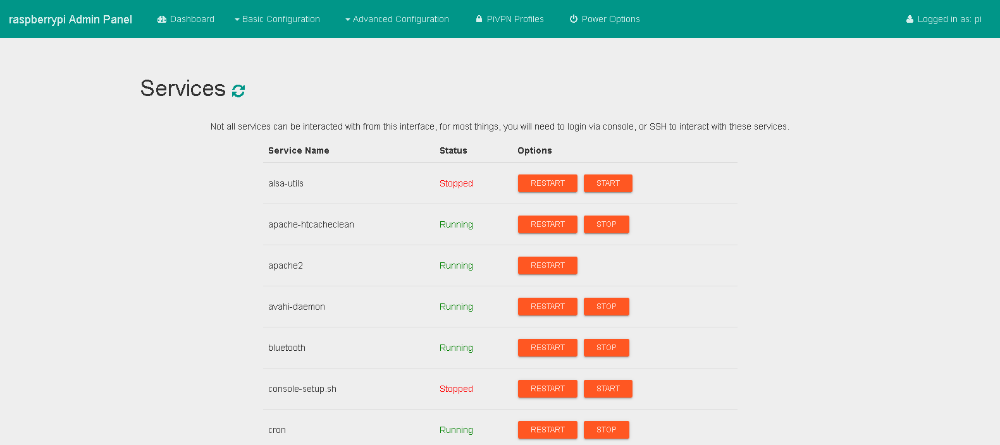
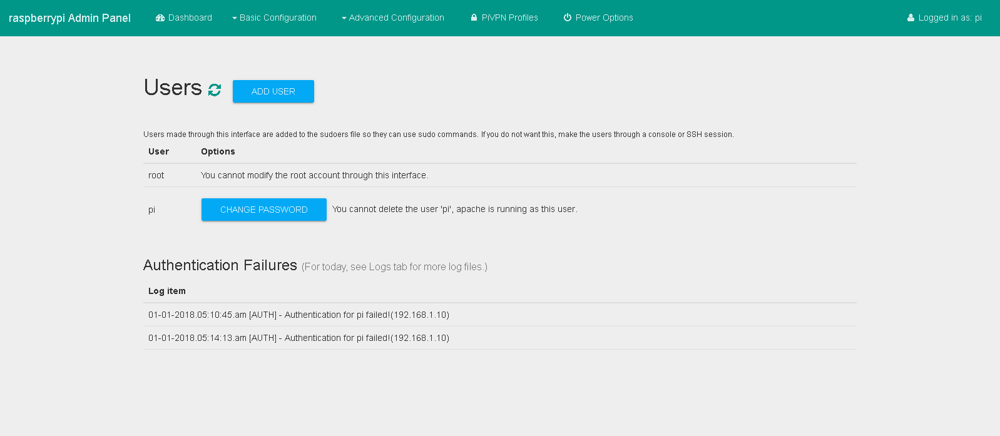

# OpenRSD - Stable - State: Usable

### What is OpenRSD

OpenRSD or ORSD is a set of PHP scripts, JS, HTML, and BootStrap CSS to create a beautiful, easy to use, responsive Dashboard to manage Raspbian based distros for the RPi2-3.

After months of testing, OpenRSD seems to be stable. Please put issues on GitHub if you find any bugs. 

**PLEASE KEEP IN MIND THAT ONCE APACHE (or other webserver) IS RUNNING AS A USER WITH SUDO RIGHTS, IT SHOULD NOT BE ACCESSIBLE VIA THE INTERNET TO KEEP SECURITY AS BEST AS POSSIBLE. AND ALTHOUGH NOT AS BIG A DEAL AS BEING INTERNET ACCESSIBLE, PLEASE ALSO NOTE THAT THIS CAN STILL CAUSE ISSUES ON LAN. (Say as an example an attacker got on your network, they could try and access the Pi.)**

### OpenRSD How to install & Use

Installing OpenRSD is pretty simple to do. Just follow the below instructions:


#### Recommended Installation

*This does not install a webserver, but instead uses PHP's built in webserver to serve up OpenRSD.

```bash
sudo apt install php php-mbstring php-curl php-readline php-xml php-json php-pear lsof git expect geoip-bin shellinabox needrestart
sudo mkdir /var/www
cd /var/www
sudo useradd -r openrsd -d /home/openrsd
sudo adduser openrsd sudo
sudo mkdir /home/openrsd
echo "openrsd ALL=(ALL) NOPASSWD: ALL" | sudo tee --append /etc/sudoers.d/010_openrsd-nopasswd
sudo git clone https://github.com/mitchellurgero/openrsd
sudo cp openrsd/openrsd.service /etc/systemd/system/openrsd.service
sudo systemctl daemon-reload
sudo systemctl enable openrsd
sudo systemctl start openrsd
# Verify openrsd service loaded:
sudo systemctl status openrsd
```

__Recommendations for PHP CLI__

Not required, but modify /etc/php/version/cli/php.ini so that:

- max_execution_time = 300

OpenRSD should now be available at *http://pi_ip:8088/*

#### Installing pivpn as the OPENRSD user

You must install pivpn AS openrsd in order for it to work properly in the UI:

```bash
sudo su - openrsd
curl -L https://install.pivpn.io | bash
```


#### ADVANCED INSTALLATION

When using the advanced instructions to install, PiVPN must be installed as the same user that installed OpenRSD (www-data as an example)

1.  This script is only tested on Raspbian, please make sure you are running a distro based on that, or running Raspbian.

2.  Once Raspbian (Or Raspbian based OS) is installed, run(Note: The following is just the BARE MINIMUM to get OpenRSD to run properly, PiVPN and Samba must be installed separately!):
    ```
    sudo apt-get update && sudo apt-get install lsof git apache2 php5 libapache2-mod-php5 php5-mcrypt expect geoip-bin shellinabox needrestart
    ```

    In case you have **Raspbian Stretch** you have to set up **lighttpd and php7.0-fpm** as the BARE MINIMUM:
    ```
    sudo apt-get update && sudo apt-get upgrade -y && sudo apt-get -y install lsof git lighttpd php7.0 php7.0-fpm php7.0-curl php7.0-gd php7.0-intl php7.0-mbstring php7.0-mcrypt php7.0-readline php7.0-xml php7.0-zip php-pear expect geoip-bin shellinabox needrestart
    ```

3.  Once that is done, run "sudo nano /etc/apache2/apache2.conf" Edit the User and Group to the user/group pi, it should look like this. **(Changing apache2 config does not need to be done if using Lighttpd or nginx!)**

        ...Some Config stuff...
        User pi
        Group pi
        ...Some Config stuff...

    For **Raspbian Stretch** with **lighttpd and php7.0-fpm** you should run the following to raise the max execution timeout to 300 seconds, allow passwordless sudo for www-data user, and switch on php for lighttpd:

        sudo sed -i -e "s/^max_execution_time =.*/max_execution_time = 300/g" /etc/php/7.0/fpm/php.ini

        cat << EOF | sudo tee /etc/lighttpd/conf-available/15-fpm-php.conf
        fastcgi.server += (".php" => ((
            "socket" => "/run/php/php7.0-fpm.sock"
        )))
        EOF

        echo "www-data ALL=(ALL) NOPASSWD: ALL" | sudo tee --append /etc/sudoers.d/010_pi-nopasswd
        sudo lighttpd-enable-mod fastcgi
        sudo lighttpd-enable-mod fpm-php
        sudo service php7.0-fpm force-reload
        sudo service lighttpd force-reload

4.  Then to **disable the debian default forced SSL** run: `sudo sed -i -e "s/SHELLINABOX_ARGS=.*/SHELLINABOX_ARGS=\"--no-beep -t\"/g" /etc/default/shellinabox`

5.  Then run: `sudo service apache2 restart` or 
    For **Raspbian Stretch** run: `sudo service lighttpd force-reload`

6.  Check that the webserver is listening on port 80 with:
`sudo lsof -i TCP:80`
> **You should see for apache2 server similar like this:**
> ```
> COMMAND   PID     USER   FD   TYPE   DEVICE SIZE/OFF NODE NAME
> apache2  PIDNo     root    8u  IPv6 85141890      0t0  TCP \*:http (LISTEN)
> apache2  PIDNo pi    8u  IPv6 85141890      0t0  TCP \*:http (LISTEN)
> apache2 PIDNo pi    8u  IPv6 85141890      0t0  TCP \*:http (LISTEN)
> ```
>
> **For Raspbian Stretch with lighttpd server you should see similar like this:**
> ```
> COMMAND   PID     USER   FD   TYPE   DEVICE SIZE/OFF NODE NAME
> lighttpd  PIDNo     root    8u  IPv6 85141890      0t0  TCP \*:http (LISTEN)
> lighttpd  PIDNo www-data    8u  IPv6 85141890      0t0  TCP \*:http (LISTEN)
> lighttpd PIDNo www-data    8u  IPv6 85141890      0t0  TCP \*:http (LISTEN)
> ```
>

7.  Then run: `cd /var/www/html`
8.  **Optionally** run: `sudo rm -f index.html`
9.  To clone the OpenRSD github repository to **/var/www/html/openrsd** now run:
`sudo git clone https://github.com/mitchellurgero/openrsd /var/www/html/openrsd`
    
10. To make sure that permissions are correct, run this: `sudo chown -R pi:pi /var/www/html` or
    For **Raspbian Stretch** run: `sudo chown -R www-data:www-data /var/www/html`
    
11.  Once the command finishes running, you can go to the following URL to access the admin panel for your pi: "[http://YourPIsIPAddress/openrsd](http://YourPIsIPAddress/openrsd)"
12.  Login with the user pi, and whatever password you have set for that user.

### Updating OpenRSD

As long as you have not modified any of the files, updating is pretty simple: Just run `git pull` in the /var/www/html/openrsd directory. Or through the web interface: Advanced Configuration -> Updates

### Login is not working, help?

If you are on a Raspberry Pi of any model, please open an issue and submit your apache logs (make sure no sensitive data is in there!).

If you are NOT on a raspberry pi, but on a clone board or maybe even a VPS or something, try the following, just make sure you are in OpenRSD's `app/bin` directory.

```bash
apt install libpam0g-dev
apt install build-essential
cd /path/to/openrsd
cd app/bin
gcc pam.c -lpam -lpam_misc -o -o ckpasswd-custom
```

What the above code does is it compiles a custom check password binary specific to your setup. This is what allows the PAM authentication.

## Screenshots




